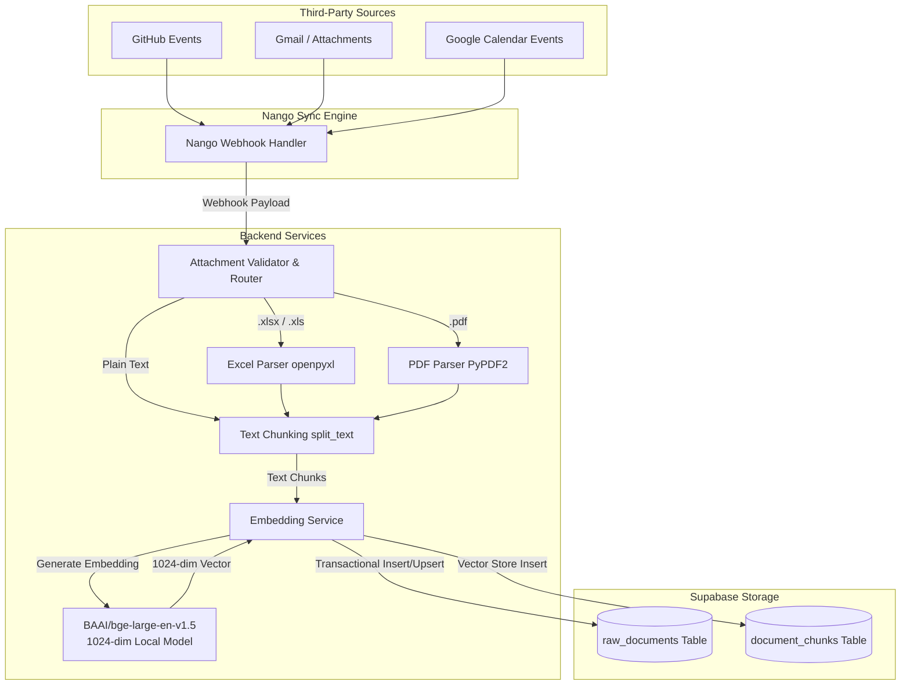
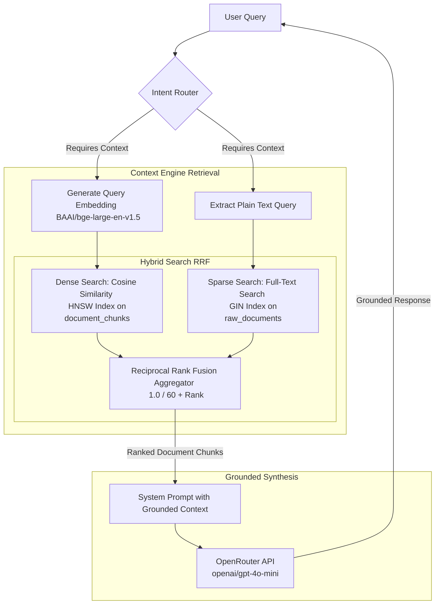

# Junior CAO

### About
Junior CAO is a high-performance, feature-focused Assistant Chat Overlay application designed to serve as an intelligent context-aware copilot. By integrating communication platforms and repositories with a retrieval-augmented generation (RAG) framework, it retrieves, normalizes, embeds, and queries workspace context to assist users with grounded conversations.

---

### Third-Party APIs Consumed
- **Nango API**: Facilitates secure OAuth connection establishment and unified webhook-driven synchronization across platforms.
- **OpenRouter API**: Manages large language model inferences (specifically leveraging `openai/gpt-4o-mini` by default) for user query intent classification and response synthesis.
- **GitHub API**: Ingests issue events, pull requests, and commit logs (synced via Nango).
- **Google Workspace APIs (Gmail & Google Calendar)**: Synchronizes emails, message attachments (PDF, Excel parsed text), and calendar events (synced via Nango).
- **Supabase**: Serves as the cloud database and vector store, utilizing `pgvector` for storing and performing hybrid searches.

---

### Connected Data Sources
The RAG pipeline ingests and synchronizes context from the following workspace sources:
- **GitHub**: Code repositories, issue trackers, pull requests, and commit logs.
- **Gmail**: Inbound and outbound emails, thread context, and parsed file attachments (PDFs and Excel spreadsheets).
- **Google Calendar**: Planned meetings, schedule details, participants, and event descriptions.

---

### System Architecture & Data Flow

#### 1. Nango to Supabase Data Flow (Ingestion & Normalization)
This diagram illustrates how data is ingested from external third-party sources (GitHub, Gmail, Google Calendar) via Nango webhooks, normalized, chunked, embedded, and saved transactionally to Supabase.



---

#### 2. Context Engine (Retrieval & Grounding)
This diagram outlines how context is searched using a hybrid approach (Dense Vector Embedding Search + Sparse Full-Text Search) combined via Reciprocal Rank Fusion (RRF), and how retrieval results are used to ground the LLM's responses.



---

#### 3. Orchestration Workflow (LangGraph Agentic Loop)
This diagram details the core orchestration flow of the agent. The agent determines user intent, conditionally calls tools (like `database_search`), validates context grounding, and outputs the final response.


### Decisions, Tradeoffs, and Future Roadmap

| Area | Current Setup | Alternative Options | Rationale for Current Choice | Planned Improvement & Impact |
| :--- | :--- | :--- | :--- | :--- |
| **Vector Embedding Model** | Local `BAAI/bge-large-en-v1.5` (1024-dim) via `sentence-transformers` | Cloud APIs (OpenAI `text-embedding-3-large`, Cohere) | **Cost & Latency**: Eliminates per-token API billing and guarantees zero external network hops during large ingestion webhooks. | **Hybrid Routing**: Fall back to cloud APIs dynamically under high server load. *Impact*: Decreases local server CPU/memory spikes. |
| **Data Partitioning (Chunking)** | Fixed-size sliding character chunking | Semantic layout-based, Token-based, or Hierarchical chunking | **Speed & Simplicity**: Fast, high-throughput parsing without requiring complex structural layout engines. | **Semantic Paragraph Parsing**: Split text at natural paragraph or table boundaries. *Impact*: Eliminates split sentences, directly boosting vector matching accuracy. |
| **Vector Storage Architecture** | Supabase database utilizing the `pgvector` extension | Dedicated Vector Databases (Pinecone, Qdrant, Milvus) | **Relational Co-location**: Permits transactional updates, direct JOINs, and unified Row Level Security (RLS) policies on one engine. | **Index Parameter Tuning**: Fine-tune `m` and `ef_construction` values for HNSW. *Impact*: Retains sub-millisecond retrieval speeds as scale increases. |
| **Search & Retrieval Strategy** | Reciprocal Rank Fusion (RRF) merging Cosine HNSW Similarity and GIN Full-Text Search | Pure Vector Search, BM25-only search, or Cross-Encoder Re-ranking | **Robustness**: RRF compensates for vector vocabulary mismatch by combining dense query semantics with exact keywords. | **Cross-Encoder Re-ranking**: Inject a lightweight Cross-Encoder model to re-score the top-k results. *Impact*: Maximizes LLM answer accuracy by feeding only the most relevant snippets. |

---

### Example Queries & Grounding Verification Guide

Below are three representative queries showing the final response structure, grounding logic, and citation mapping:

#### Query 1: "What should I focus on today?"
- **Question**: `What should I focus on today?`
- **AI Answer**: 
  ```text
  > - Confirm attendance for the meeting today. See details in the email reminder: Email: Meeting Reminder ⚠️ [MOCK DATA]
  > - Send over the details for the take-home assignment as discussed. Refer to the email: Email: Take Home Assignment ⚠️ [MOCK DATA]
  > - Attend the meeting with Sarah Jenkins for the seed round discussion at 10:00 AM. More info here: Event: Seed Round Discussion ⚠️ [MOCK DATA]
  > - Prepare for the upcoming TMLS listing presentation to discuss commission rates with John and the client from 2:00 PM to 3:00 PM. Link: Event: TMLS Listing Presentation ⚠️ [MOCK DATA]
  > - Review proposed focus items for the linkmate project, especially regarding the SSI growth strategies discussed in the GitHub agenda. More details: GitHub: Next Steps ⚠️ [MOCK DATA]
  ```
- **How it is Grounded**: The agent runs a hybrid vector search using query parameters to match today's date context and platform activity (e.g. today's Calendar events, recent Gmail threads, and outstanding GitHub issue descriptions).
- **Citations & Link Generation**:
  - Since the context chunks for these items were inserted into Supabase with `is_mock = TRUE`, the system wraps the source in `⚠️ [MOCK DATA CONTENT]`.
  - The synthesis engine detects the mock metadata and appends the warning label `⚠️ [MOCK DATA]` to the corresponding bullet points.
  - The hyperlinks are built dynamically by the backend router. If these were real data, the link destinations would be:
    - **Gmail**: `https://mail.google.com/mail/u/0/#inbox/{external_message_id}`
    - **Calendar**: `https://calendar.google.com/calendar/r/event/{external_event_id}`
    - **GitHub**: `https://github.com/shyamal-bhatt/Junior-CAO/issues/{external_issue_id}`

---

#### Query 2: "What follow-ups am I missing?"
- **Question**: `What follow-ups am I missing?`
- **AI Answer**:
  ```text
  > - Send the updated financial projection spreadsheet to Sequoia Capital. They need it by Friday morning. See email for details: Email: Follow up on pitch deck financial models ⚠️ [MOCK DATA]
  > - Review the TMLS contract for 123 Main St today. Signing is tomorrow morning. Finalize the listing price. Contract details: Document: TMLS contract ⚠️ [MOCK DATA]
  > - Schedule the investor call with Sarah Jenkins today. They want to discuss the seed round term sheet. Check the initial draft here: Document: Investor Call Term Sheet ⚠️ [MOCK DATA]
  ```
- **How it is Grounded**: Grounded by retrieving specific emails containing unresolved actions (e.g., messages with action verbs like "send", "review", or "schedule") and parsed attachment text from associated contracts or spreadsheets.
- **Citations & Link Generation**:
  - The citations (e.g., `Document: TMLS contract`) reference a parsed file attachment.
  - **Link Generation Rule**: If the document title starts with `Attachment:`, the backend parser extracts the filename and formats a Gmail attachment search link:
    `https://mail.google.com/mail/u/0/#search/has%3Aattachment+filename%3A{filename}`
  - Non-attachment emails map directly to their thread URI: `https://mail.google.com/mail/u/0/#inbox/{external_id}`.

---

#### Query 3: "what is the recent PR in Linkmate project on github"
- **Question**: `what is the recent PR in Linkmate project on github`
- **AI Answer**:
  ```text
  > - The most recent pull request in the LinkMate project, closed on June 9, 2026, features improvements including a global pause killswitch, fixes for the SDUI parser against LinkedIn's 2026 redesign, and a complete overhaul of the AI comment generator. Major changes include:
  >   - A global pause switch...
  >   - Updates to feed parsing logic...
  > - Full details can be found at the GitHub link: GitHub: LinkMate PR ⚠️ [MOCK DATA]
  ```
- **How it is Grounded**: Grounded in the normalized repository pull request events stored under the `Linkmate` project tag in Supabase. The database search pulls metadata from `raw_documents` where `platform = 'github'` and `project_tag = 'Linkmate'`.
- **Citations & Link Generation**:
  - **Link Generation Rule**: If the record platform is `github` and the external ID is a numeric string (e.g. `42`), it constructs a direct issue/PR path:
    `https://github.com/shyamal-bhatt/Junior-CAO/issues/{external_id}`
  - If the external ID is a text hash or string, it defaults to a query-escaped search page:
    `https://github.com/shyamal-bhatt/Junior-CAO/search?q={url_encoded_id}`


