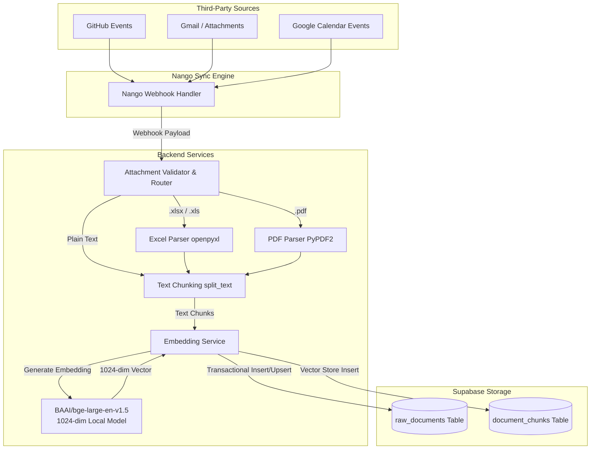
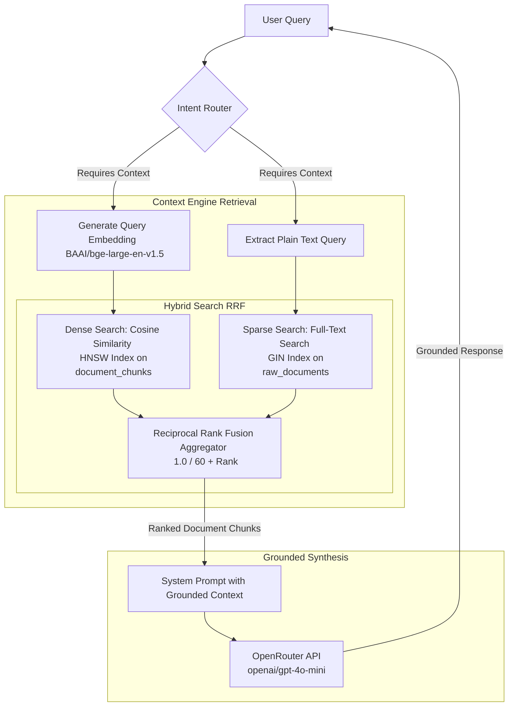
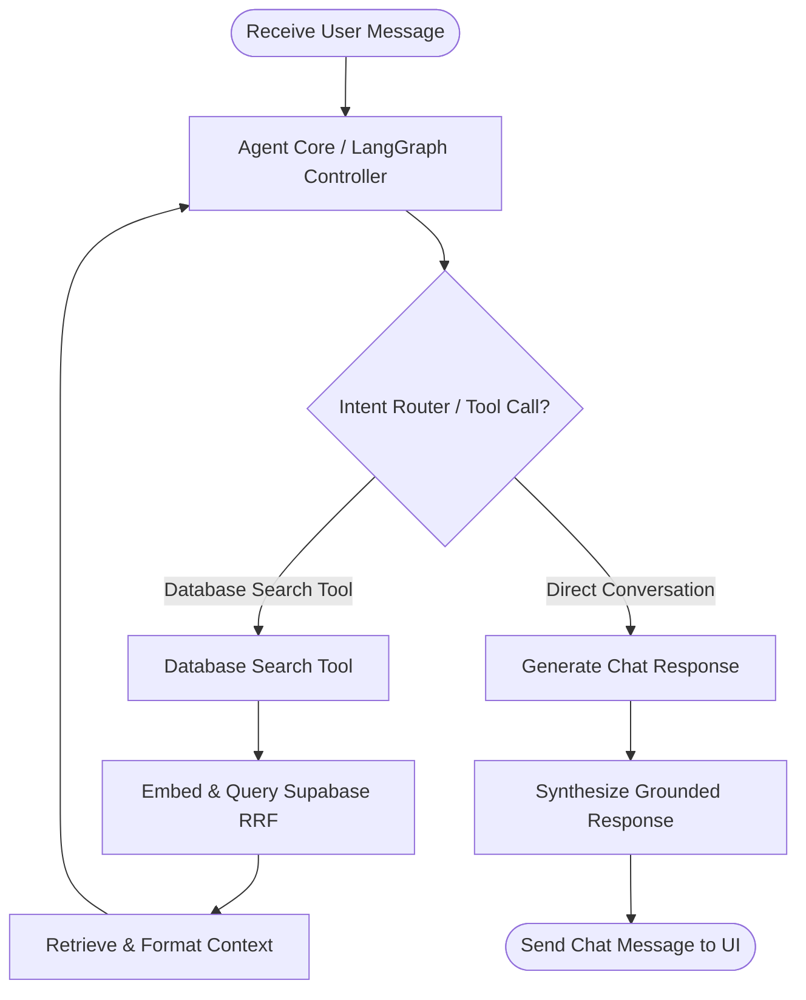

# Junior CAO

### About
Junior CAO is a high-performance, feature-focused Assistant Chat Overlay application designed to serve as an intelligent context-aware copilot. By integrating communication platforms and repositories with a retrieval-augmented generation (RAG) framework, it retrieves, normalizes, embeds, and queries workspace context to assist users with grounded conversations.

---

### Third-Party APIs Consumed
- **Nango API**: Facilitates secure OAuth connection establishment and unified webhook-driven synchronization across platforms.
- **OpenRouter API**: Manages large language model inferences (specifically leveraging `openai/gpt-4o-mini` by default) for user query intent classification and response synthesis.
- **GitHub API**: Ingests issue events, pull requests, and commit logs (synced via Nango).
- **Google Workspace APIs (Gmail & Google Calendar)**: Synchronizes emails, message attachments (PDF, Excel parsed text), and calendar events (synced via Nango).
- **Supabase**: Serves as the cloud database and vector store, utilizing `pgvector` for storing and performing hybrid searches.

---

### Connected Data Sources
The RAG pipeline ingests and synchronizes context from the following workspace sources:
- **GitHub**: Code repositories, issue trackers, pull requests, and commit logs.
- **Gmail**: Inbound and outbound emails, thread context, and parsed file attachments (PDFs and Excel spreadsheets).
- **Google Calendar**: Planned meetings, schedule details, participants, and event descriptions.

---

### System Architecture & Data Flow

#### 1. Nango to Supabase Data Flow (Ingestion & Normalization)
This diagram illustrates how data is ingested from external third-party sources (GitHub, Gmail, Google Calendar) via Nango webhooks, normalized, chunked, embedded, and saved transactionally to Supabase.

---

#### 2. Context Engine (Retrieval & Grounding)
This diagram outlines how context is searched using a hybrid approach (Dense Vector Embedding Search + Sparse Full-Text Search) combined via Reciprocal Rank Fusion (RRF), and how retrieval results are used to ground the LLM's responses.

---

#### 3. Orchestration Workflow (LangGraph Agentic Loop)
This diagram details the core orchestration flow of the agent. The agent determines user intent, conditionally calls tools (like `database_search`), validates context grounding, and outputs the final response.

---

### Tradeoffs & Future Improvements

#### Tradeoffs
- **Local Embedding Computation**: Generating embeddings locally using `BAAI/bge-large-en-v1.5` eliminates external API network hops and costs. However, it incurs significant memory and CPU overhead on the backend host compared to utilizing SaaS embedding endpoints (like OpenAI or Cohere).
- **Basic Fixed-Size Chunking**: The current chunking logic uses character-based fixed intervals. This is highly performant and easy to implement but sometimes splits semantic boundaries (e.g., sentences, tables), which can dilute matching accuracy.
- **Relational + Vector Co-location**: Storing both relational data and vector embeddings inside Supabase (PostgreSQL with `pgvector`) simplifies schema management and guarantees transaction integrity. However, it binds scaling limits of the vector storage to the database instance itself.

#### Future Improvements
- **Semantic/Hierarchical Chunking**: Implement layout-aware parsing for documents and attachments to split chunks along natural document hierarchy boundaries.
- **Cross-Encoder Re-ranking**: Integrate a local or lightweight hosting-based Cross-Encoder model to re-rank the retrieved results post-RRF, maximizing query relevance.
- **Context Grounding Guardrails**: Introduce hallucination detection or automated checking to score the LLM output's factual alignment with the retrieved document chunks.
- **Stateful Conversational Memory**: Persist user preferences and long-term summaries in PostgreSQL to enable personalized agent interactions across chat sessions.

